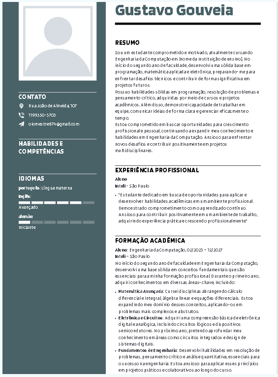

# Título do Documento

Aqui está um exemplo de como adicionar uma imagem em um arquivo markdown:

Lembre-se de substituir 'caminho/para/sua/imagem.jpg' pelo caminho real da sua imagem e fornecer um texto alternativo adequado para acessibilidade.
